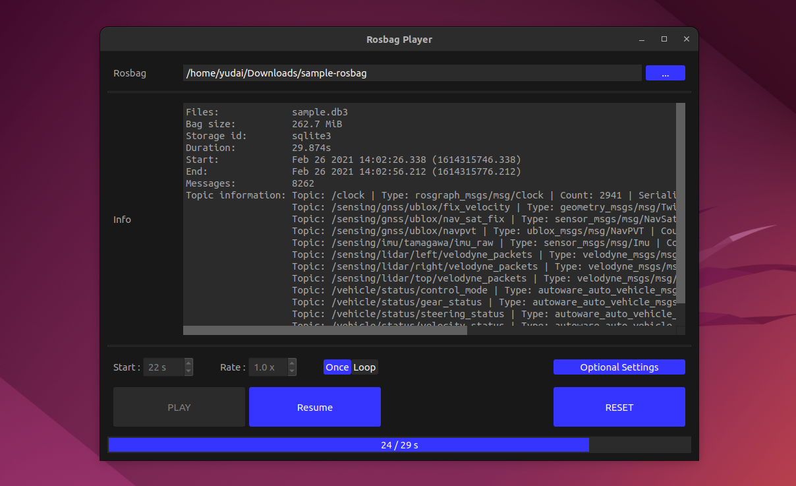

# Rosbag Player 

GUI player for Rosbag2.



## Install and Setup

Run setup scripts.

```
./setup.sh
```

Right-click the Rosbag2(.db3) file.

Click on "Properties" and go to "Open With" tab.

Find "RosbagPlayer" in the list and click "Set as default".

## Usage

Double-click the Rosbag2(.db3) file to launch the application.


---

2022.12 yudai.yamazaki